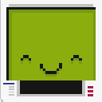

# Codiquest

¡Hola soy Codi! y esta es mi plataforma, Codiquest 🥰. He creado una plataforma de aprendizaje interactivo construida con SvelteKit. Aunque se trata de un **pet project** creado en ratos libres cuyo objetivo es facilitar la creación de cursos y cuestionarios dinámicos mediante módulos personalizables, sin necesidad de un backend y con posibilidad de alojarlo de forma gratuita en Github Pages (u otros). ¿Quieres saber más? A lo largo de este documento, o dentro del directorio `docs` encontrarás manuales detallados sobre cómo usar y extender el sistema.

> Descargo de responsabilidad: el proyecto se ofrece tal cual, sin garantía ni soporte oficial (◕‿◕✿)

## 🔧 Instalación rápida en local

1. Clona este repositorio con `git clone git@github.com:moiseslodeiro/codiquest.git`
2. Instala las dependencias con `npm install` (se recomienda Node 22 o superior)
3. Ejecuta `npm run dev` para lanzar el entorno de desarrollo y abre la web que por defecto estará en `http://localhost:5173/`

Consulta la guía de [instalación en local](https://demo.codiquest.com/docs/instalacion-en-local) para más detalles y el apartado `Guías de uso` de esta misma página

## 👋 Demo

¿Quieres ver cómo se ve antes de instalarlo? Accede a <https://demo.codiquest.com>, donde además del contenido básico pueden aparecer otros contenidos o actualizaciones con cursos adicionales.

## 💼 Guías de uso

¿List@ para empezar a agregar tu propio contenido? Puedes darle un vistazo directamente a la [documentación en web de demo](https://demo.codiquest.com/docs) o bien en el propio apartado de la [documentación](/docs) del repositorio 🤗

- [Instalación en local](docs/docs.md#instalación-en-local)
- [Entendiendo y creando módulos](docs/modules.md)
- [Crear un nuevo módulo](docs/modules.md#crear-un-nuevo-módulo)
- [Crear una página](docs/modules.md#creando-nuestra-primera-página)
- [Componentes](docs/components.md)
- [Añadiendo cuestionarios](docs/questions.md)
- [Automatizando módulos con Markdown](docs/modules_auto.md)
- [Automatizando cuestionarios con Markdown](modules_auto.md#automatización-de-preguntas)
- [Personalizando tu Codiquest](docs/docs.md#personalizando-codiquest)
- [Publicando la build en Github](docs/docs.md#publicando-la-build-en-github)
- [Compilando y publicación con Workflows](docs/docs.md#compilado-y-publicación---workflows)
- [Configurando Github Pages](docs/docs.md#configurando-github-pages)
- [Instalando Codiquest en remoto - Completa](docs/docs.md#instalación-remota-completa)
- [Instalando Codiquest en remoto - Parcial](docs/docs.md#instalación-remota-parcial)

## 📄 Licencia

Este proyecto se distribuye bajo los términos de la licencia MIT. Puedes consultar el texto completo en [aquí](static/LICENSE).

## 🛡️ Auditoría de seguridad

Se han revisado todas las vulnerabilidades reportadas por `npm audit` a fecha de **julio de 2025**

- Todas las vulnerabilidades de nivel **high** o **critical** han sido mitigadas
- Las advertencias restantes son de nivel **moderate o low**, y afectan únicamente a herramientas de desarrollo como:
  - `vite`, `esbuild`, `vitest`, `vitefu`, etc.
  - Las vulnerabilidades XSS asociadas a `@sveltejs/kit` solo afectan al entorno de **desarrollo (dev)** y no a producción.
- No hay impacto real en el entorno de producción, ya que estas dependencias no se ejecutan fuera del entorno local o de pruebas.

Estas vulverabilidades deberían estar solventadas actualizando a una versión superior de vite y svelte (en este caso), pero no sólo es el propio módulo de npm sino que esto implica cambios en el código. Si alguien se anima a actualizarlo, ¡bienvenid@ sea ese fork! :-)

## 🐵 Autor

Este proyecto fue creado con cariño y ~~algo de~~ mucho café por [Moisés Lodeiro](https://www.moiseslodeiro.es). No dudes en escribirme o seguirme en alguna de mis redes sociales como [Twitter/X](https://twitter.com/MoisesLodeiro) o [LinkedIn](https://www.linkedin.com/in/moiseslodeiro/) si encuentras algo raro o simplemente quieres saludar ☺️
